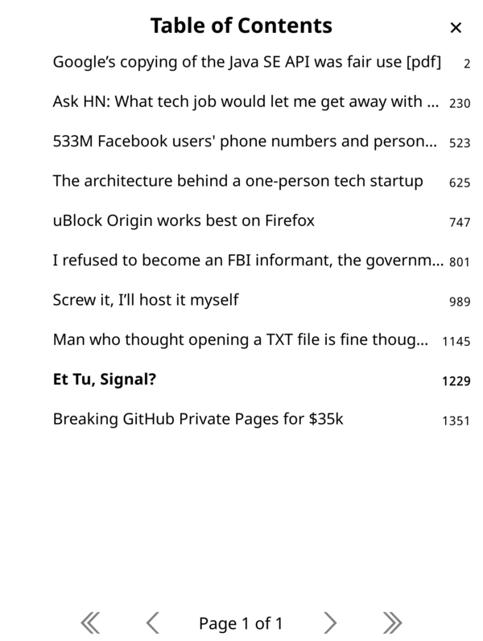
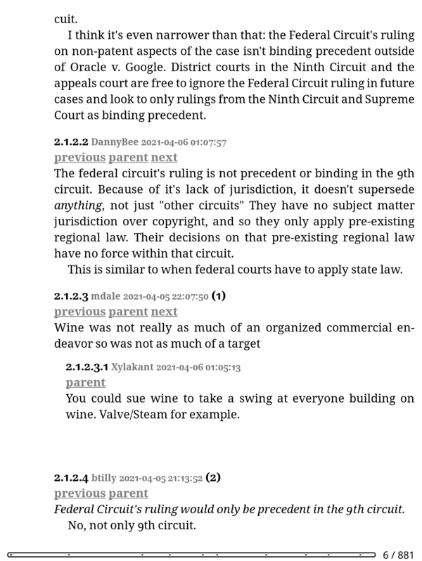
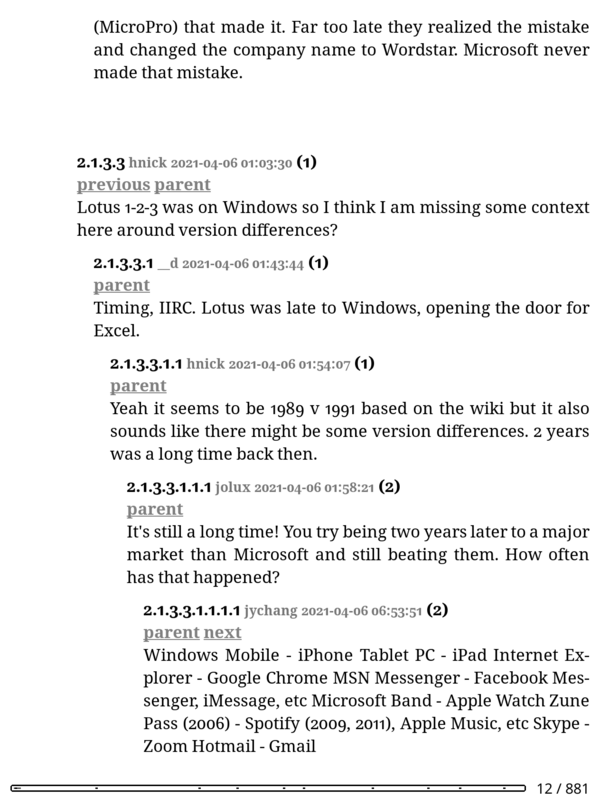
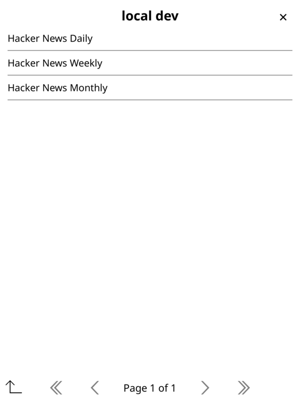
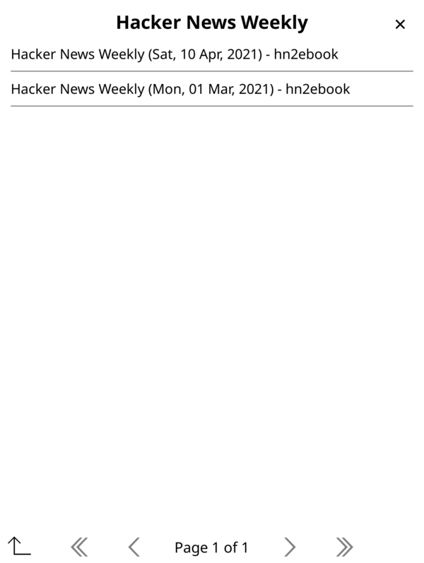

# hn2ebook

> I want to read a collection of the best HN stories once a week or once a month.
> I want the discussion in the comment section included. I want it offline and on
> my e-ink device.
> — author

## What?

This is a command line utility that you can use to create a periodical style
ebook (currently EPUB is supported) of the best hacker news stories in a certain
timeframe. The ebook will contain chapters where each chapter is an HN story.
The chapters contain the extracted article text and images, if possible to
extract. After the article all the HN comments (at the time the program is ran)
will be rendered in a threaded display that works (well enough if not great) on
an e-reader screen.

### Screenshots

|                                                                                       |                                                                                              |
| :-----------------------------------------------------------------------------------: | :------------------------------------------------------------------------------------------: |
| [](docs/img/3.png) <br/> Table of contents |         [](docs/img/4.png) <br/> Article content         |
|    [](docs/img/5.png) <br/> Threaded comments    | [](docs/img/6.png) <br/> More threaded comments |
|     [](docs/img/1.png) <br/> OPDS feed index      |        [](docs/img/2.png) <br/> OPDS weekly feed        |

## Quickstart

If you get stuck, or you balk at the install commands below (which I expect you
should), then please refer to the more comprehensive "How" section below.

These quickstart commands _demonstrate_ the minimum needed to get started, but I don't
actually recommend installing this way.

```console
$ python --verssion
Python 3.9.1
$ git clone https://github.com/ramblurr/hn2ebook
$ cd hn2ebook
$ pip install --user -e .
$ npm install -g 'git@github.com:Ramblurr/srcset-parser.git#0.0.1'
$ npm install -g 'git@github.com:Ramblurr/readability_extractor.git#0.0.1'
$ mkdir ~/.config/hn2ebook
$ cp config.toml.sample ~/.config/hn2ebook/config.toml
$ ed ~/.config/hn2ebook/config.toml
# edit paths
$ hn2ebook --help

Usage: hn2ebook [OPTIONS] COMMAND [ARGS]...

  Create self-contained e-books with the best stories and comments from
  Hacker News, with embedded comments! Requires regular polling of the best
  stories feed (use the update command in a cron job for that).

  It will look for a config.toml file in the current directory, under
  $XDG_CONFIG_HOME, or /etc/hn2ebook, or under the HN2EBOOK_CONFIG
  environment variable.

  Please consult full documentation at https://github.com/ramblurr/hn2ebook

Options:
  --version                       Show the version and exit.
  --config FILE                   Path to the configuration file
  --logfile FILE                  Path to the log file, useful for cron jobs
  --loglevel [CRITICAL|ERROR|WARNING|INFO|DEBUG]
                                  Set the log level (overrides --verbose)
  --logformat TEXT                Set log format string, useful for cron jobs
  -v, --verbose
  --help                          Show this message and exit.

Commands:
  backfill       Backfills the database of best stories.
  custom-issue   Create epub from a hand-picked list of story ids
  generate-feed  Generate an OPDS feed into data_dir.
  list           List previously generated issues in database
  migrate-db     Apply all database migrations.
  new-issue      Create an ebook of the best HN stories for the given...
  update         Updates the database of current best stories.

$ hn2ebook update
Processed 200 stories with 200 new entries
$ export START=$(date --date "7 days ago" "+%Y-%m-%d")
$ export END=$(date "+%Y-%m-%d")
$ hn2ebook backfill  --start-date $START --end-date $END
Backfilling from 2021-04-03 to 2021-04-10
backfill from daemonology 2021-04-03 00:00:00
backfill from daemonology 2021-04-04 00:00:00
backfill from daemonology 2021-04-05 00:00:00
backfill from daemonology 2021-04-06 00:00:00
backfill from daemonology 2021-04-07 00:00:00
backfill from daemonology 2021-04-08 00:00:00
backfill from daemonology 2021-04-09 00:00:00
$ hn2ebook new-issue --period weekly
⚠️ Please be warned! This can take awhile, as walking the HN comments tree with the API is time intensive.
creating weekly periodical as of 2021-04-10 00:00:00, with limit=10, sort_criteria=points
collecting stories for range 2021-04-03 - 2021-04-11
winnowed 336 stories down to 10
extracting article and comments from 10 stories
fetching story with comments and article id=26699106
skipping non-text content application/pdf
walking descendants tree for comments
fetching story with comments and article id=26721951
walking descendants tree for comments
fetching story with comments and article id=26681969
extracting article content
walking descendants tree for comments
fetching story with comments and article id=26737771
extracting article content
walking descendants tree for comments
fetching story with comments and article id=26755252
extracting article content
walking descendants tree for comments
fetching story with comments and article id=26715644
extracting article content
content missing in readable result for https://www.aclu.org/news/national-security/i-refused-to-become-an-fbi-informant-and-the-government-put-me-on-the-no-fly-list/
walking descendants tree for comments
fetching story with comments and article id=26725185
extracting article content
walking descendants tree for comments
fetching story with comments and article id=26677112
extracting article content
walking descendants tree for comments
fetching story with comments and article id=26724237
extracting article content
walking descendants tree for comments
fetching story with comments and article id=26709159
extracting article content
walking descendants tree for comments
collected 10 stories for the issue
building chapter for story id=26699106
building chapter for story id=26721951
building chapter for story id=26681969
building chapter for story id=26737771
building chapter for story id=26755252
building chapter for story id=26715644
building chapter for story id=26725185
building chapter for story id=26677112
building chapter for story id=26724237
building chapter for story id=26709159
writing epub: /home/ramblurr/src/hn2ebook/data/issues/hn2ebook-weekly-2021-04-10.epub
```

## Why?

HN is addicting. Unlike other feeds and apps, I don't think HN is specifically
designed with features to co-opt your attention. It's just naturally addicting.

Like a true addict, I don't want to give up my substance entirely, just cut back
to "appropriate" levels. What is appropriate for me has changed over the years.
Now, with my young child, I don't want them to see me always flicking through
the "orange pages".

I want to set a better example. I want to claw back some control of how and
where my attention is spent.

Because we live in a techno-dystopia, total abstention isn't a possible solution
(despite what the Social Dilemma claims). Also, because we live in a
techno-dystopia the only answer I could yoink out of my brain is...
'surely more tech can solve this'.

I'd happily throw my money at a glossy (or matte!) dead-tree Hacker News
Quarterly or Monthly made of dead-trees.

Until then, well, my answer is to reduce time spend on my smartphone overall.
Some call it "screen time", but in our household an e-ink e-reader while
technically having a screen, doesn't count towards "screen time" (thank Daddy
Bezos these devices have crippled browsers and no app stores). Reading books,
newspapers, articles, and other periodicals this is time we consider well spent.
We just don't have space in our cramped 83m² EU flat to fill it with dried pulp
like my parents did in the house I grew up in back during the peak of the
American Dream, back in the expansive West. Not to mention it would cost a small
fortune to subscribe to the english language content I'd want and it still
wouldn't compare to the depth and breadth of what we can read online. The
techno-dystopia has its upsides.

## Where?

Hosting this for the general HN community would be a _nice thing_ to do. However
that would entail distributing other folks' copyrighted works. Though how hn2ebook
differs substantially from Pocket, or Pinboard, or Instapaper, I'm not really sure.

So you'll need to run this program yourself from the comfort of your own
terminal or your nearest cron supplier.

hn2ebook is a command line program written in python. You'll need the following
pre-reqs installed:

- Python 3 (developed against 3.9)
- [srcset-parser](https://github.com/Ramblurr/srcset-parser)
- [readability-extractor](https://github.com/Ramblurr/readability-extractor)
- [chromedriver](https://chromedriver.chromium.org/downloads) (optional, but
  recommended for better article extraction. you can get it from most distro
  repos)

I develop the program on Linux. Patches to support other operating systems are
welcome.

To install it:

```console
$ git clone https://github.com/ramblurr/hn2ebook
$ cd hn2ebook
$ pip install --user -e .
```

## How to use it?

hn2ebook uses a combination of command line flags and a config file. The config
file is mandatory (for now). You can find a documented example config file at
[config.toml.sample](config.toml.sample).

### Config file

The config file is in the [toml](https://toml.io/en/) format. It needs a
`[hn2ebook]` block.

| param                   | type                               | description                                                                                                                                                                       |
| ----------------------- | ---------------------------------- | --------------------------------------------------------------------------------------------------------------------------------------------------------------------------------- |
| `readability_bin`       | required, file path                | The path to the [readability-extractor](https://github.com/Ramblurr/readability-extractor) script, used to extract the article content from web pages                             |
| `srscetparser_bin`      | required, file path                | The path to the [srcset-parser](https://github.com/Ramblurr/srcset-parser) script, used to parse `srcset` tags in html                                                            |
| `data_dir`              | required, dir path                 | A local directory (will be created) where the ebooks and OPDS feeds will be written. If the config file is in XDG_CONFIG_HOME/hn2ebook, then XDG_DATA_DIR will be used by default |
| `root_url`              | required url                       | The base URL where everything under `data_dir` will be available. Used in the OPDS feeds to provide proper download links.                                                        |
| `db_path`               | required, file path                | The path to a file where the sqlite database will be written. The database is required to store the known best stories and the generated ebooks.                                  |
| `n_concurrent_requests` | optional, integer, default `10`    | The number of http requests to run in parallel                                                                                                                                    |
| `use_chrome`            | optional, boolean, default `false` | Whether or not to use a headless chrome instance to extract article content from web pages                                                                                        |

### Using docker/podman

I publish a linux x86-64 container image (built from this repo) to Docker Hub at
[docker.io/ramblurr/hn2ebook](https://hub.docker.com/repository/docker/ramblurr/hn2ebook).

```console
# pull the image
docker pull docker.io/ramblurr/hn2ebook:latest

# get the help
docker run docker.io/ramblurr/hn2ebook:latest --help
```

#### rootless podman

```bash
podman run --rm -it \
  -v $(pwd)/dev.sqlite:/dev.sqlite:Z \
  -v $(pwd)/config-docker.toml:/config.toml:Z,ro \
  -v $(pwd)/data:/data:Z \
  docker.io/ramblurr/hn2ebook \
  --help
```

#### docker

```bash
docker run --rm -it \
  -v $(pwd)/dev.sqlite:/dev.sqlite \
  -v $(pwd)/config-docker.toml:/config.toml:ro \
  -v $(pwd)/data:/data \
  docker.io/ramblurr/hn2ebook \
  --help
```

## How does it work?

With a cronjob the `update` subcommand loads the
[beststories](https://hacker-news.firebaseio.com/v0/beststories.json) feed from
the official HN API. The best stories are recorded in the sqlite database only
once, the day they first appear in the feed.

The `new-issue` subcommand accepts a `period` (daily, weekly, monthly) and a
`limit`. It will then produce an epub containing `limit` number of stories. The
story url is then fetched either with a plain GET request, or if configured, a
headless chrome instance (with a 3 second wait to let javascript munge the
page).

The HTML content is then processed locally with Mozilla's
[readability](https://github.com/mozilla/readability) library. Rudimentary
effort is made to rewrite `` and `<source>` tags, downloading and embedding
the image. Unsupported blocks such as `<iframe|object|audio|video>` are replaced
with a little note, so that when you're reading you're aware there is something
missing. Content for the story's whose server returns a content-type other than
`text/html` or `text/plain` for the url are replaced with a little note that the
article content is unavailable.

Then, the tool walks the HN API and fetches the comments for the story. This can
take awhile as one HTTP GET requested is needed for every comment (that's just
how the HN API works). The comments are rendered into the best approximation of
a "collapsible" threaded view I could manage. It allows one to navigate the
comment tree with parent, prev, and next links. For highly nested comments the
indentation gets rather extreme.

A bright orange cover is generated, and the compiled epub is written into the
`<data_dir>/issues/` directory.

The `generate-feed` subcommand will generate a static [OPDS](https://opds.io)
feed that can be used in many e-reader programs to easily download the new
issues. To serve the OPDS feed and the EPUBs themselves, you need to point a web
server at the `<data_dir>` directory. Then the feed index will be available at
`<root_url>/index.xml`

You need to bring your own web server or other method of serving static files.

## Who?

hn2ebook was created by [Casey Link](https://outskirtslabs.com). It is built using many great open source libraries.

© 2021 Casey Link

hn2ebook is licensed under the [AGPLv3](LICENSE.md).
